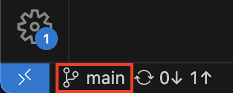
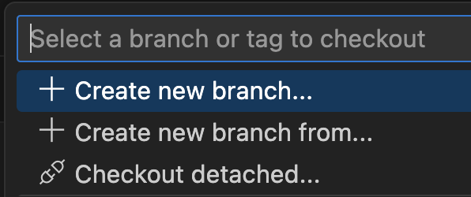
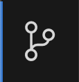
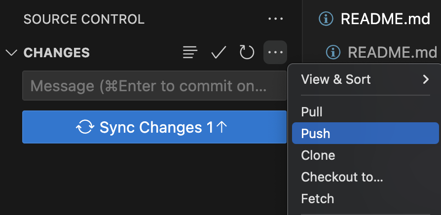
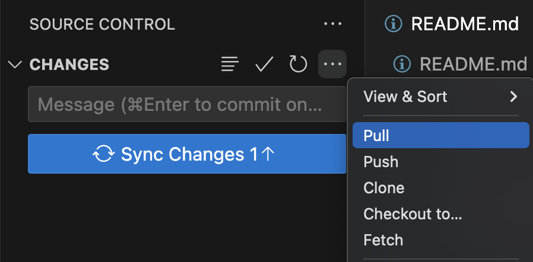

# Git-guide

## Om denne guiden
Dette er en enkel og praktisk Git-guide laget for elever på VG1 Informasjonsteknologi og medieproduksjon ved Gjennestad VGS.  
Guiden skal fungere som en referanse gjennom skoleåret, særlig i faget **IKM1003 – Konseptutvikling og programmering**, men er også nyttig for andre fag og prosjekter der Git brukes.

🛠️ Innholdet er skrevet for nybegynnere, med fokus på praktisk bruk i VS Code og GitHub.

📄 Guiden er delt under MIT-lisens og kan fritt brukes, kopieres og tilpasses av andre lærere, elever og skoler.


# Første gang

Første gang man bruker Git på en PC må man gjøre noe konfigurering. Dette gjør man kun første gangen, resten av tiden gjelder kun det som står under “Hver gang”.

## Oppsett og installasjon

- Installer **[Git for Windows](https://git-scm.com/downloads/win)**.
- Installer **[VS Code](https://code.visualstudio.com/)** og logg inn med GitHub-konto.
- Opprett en mappe som heter `Repositories` i `C:/`. Dette er der alle repo skal lagres.
- Alle repos havner da på stien: `C:/Repositories/navn_på_repo`

## Konfigurer navn og e-post i Git

Når du bruker Git for første gang på en PC, må du sette navn og e-post slik at commitene dine vises riktig på GitHub. Det gjøres i kommandolinje:
- Åpne terminal i VS Code med menyen `Terminal > New Terminal` eller `Ctrl + Shift + Ø`.
- I terminalen skriv følgende, men bytt ut med ditt eget navn:
```bash
git config --global user.name "Fornavn Etternavn"
```
- Trykk “**enter**”
- Så i terminalen skriv følgende, men bytt ut med din egen e-post (samme e-post som du bruker på GitHub):
```bash
git config --global user.email "din@email.no"
```
- Trykk “**enter**”
- Du er nå ferdig med å konfigurere Git i VS Code. 

<br><br>

# Hver gang

## Kloning av repo fra GitHub

- Gå til GitHub og finn repoet du skal klone.
- Klikk på 
- Kopier HTTPS-lenken til repoet. <br>

- Åpne VS Code og bruk ett av alternativene under:

### Alternativ 1: Clone Git Repository fra velkomstvinduet

- Åpne VS Code uten et prosjekt.
- Trykk på **"Clone Git Repository"**.
- Lim inn GitHub-lenken.
- Du blir spurt: “Velg hvor prosjektmappen skal lagres” → Velg ønsket mappe på PC-en. (f.eks. `C:/Repositories`)
- Trykk "Open" når VS Code spør.

### Alternativ 2: Bruk Command Palette

- Trykk `Ctrl + Shift + P`.
- Skriv `Git: Clone` og trykk Enter.
- Lim inn lenken.
- Velg ønsket mappe. (f.eks. `C:/Repositories`)
- Trykk "Open".

### Alternativ 3: Bruke terminal (avansert)

- Åpne VS Code og trykk på “Terminal” i menyen og så på “New Terminal” (eller hurtigtasten: Ctrl + Shift + Ø)
- Naviger til mappen ved å bruke kommandoen “cd” og stien til mappen du skal bruke:

```bash
cd C:/Repositories
```
- Trykk **Enter**
```bash
git clone https://github.com/dittbrukernavn/dittrepo.git
```
- Trykk **Enter**

## Lage ny gren (branch)
Før du begynner å gjøre endringer må du lage en ny gren(branch) slik at du ikke redigerer på “**main**”
- Trykk på grennavnet nederst til venstre i VS Code (f.eks. `main`). <br>

- Du får så opp noen alternativer øverst i VS Code. Her velger du **Create new branch...**. <br> 
- Skriv inn ønsket navn på grenen, for eksempel “oppgave-1”, “utvikling” eller “ny-funksjon” og trykk **Enter**.
- VS Code bytter automatisk til den nye grenen.

## Lage endringer og commit

- Når du er ferdig med å gjøre en endring i en fil, så må du lagre filen (`Ctrl + S`).
- Gå til Source Control-panelet  (`Ctrl + Shift + G`).
- Trykk på -ikonet ved filene du vil ha med i commit for å stage.
- Skriv en kort og tydelig commit-melding. (*Eksempel på meldinger lenger ned.*)
- Trykk på -knappen for å committe.

> 💡 **Tips:** Husk å ikke gjøre for mange endringer i samme commit.  
> En commit skal gjøres for én logisk endring av gangen – og vil ofte bare inneholde noen få linjer med kode.  
> Dette gjør det enklere å forstå hva som er gjort, og å feilsøke senere.


## Push til GitHub

- Etter commit, trykk på  <br>
- eller gå til menyen `...` > `Push`: <br>

- Du skal nå ha sendt endringene til GitHub og du kan nå sjekke at endringen er synlig der.

## Trekke inn endringer (pull)

Om noen andre har gjort endringer i repoet siden sist du synkroniserte, så trenger du å gjøre en “Pull” for å hente nye endringer fra GitHub.
- Klikk på “...” ved siden av “CHANGES”, og så trykk på “Pull”: <br>


## Løse konflikter

Konflikter kan skje hvis to personer har endret samme linje i samme fil. <br>
- VS Code viser konflikter og lar deg velge hvilke endringer som skal beholdes, eller eventuelt gjøre en ny endring som løser konflikten.
- Gjør ny commit etter at konflikten er løst.


## Bruke commit-meldinger riktig

Eksempler på gode commit-meldinger:

- ✅ `La til bilde på prosjektsiden`
- ✅ `Lagt til funksjon for X`
- ✅ `Fix: x problem`
- ✅ `Løst konflikt i navngiving`

Eksempler på dårlige commit-meldinger:
- ❌ `endring`
- ❌ `ny fil`
- ❌ `Bugfix`
- ❌ `Fix`


## Kreditering og lisens

📄 Dette prosjektet er delt under [MIT-lisensen](LICENSE).  

Du kan fritt bruke, kopiere, endre og dele innholdet – også i egne undervisningsopplegg – så lenge du gir riktig kreditering og inkluderer lisensen videre.

👤 **Laget av:** Eirik Flacké ved Gjennestad VGS  
© 2025 Gjennestad videregående skole – delt under MIT-lisens